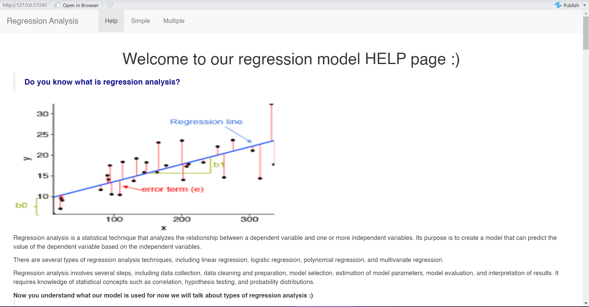
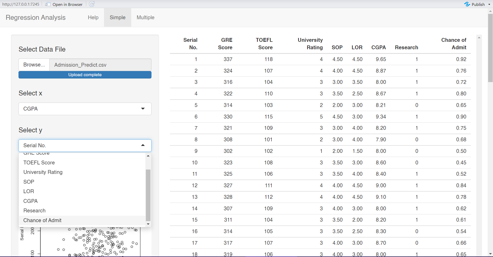
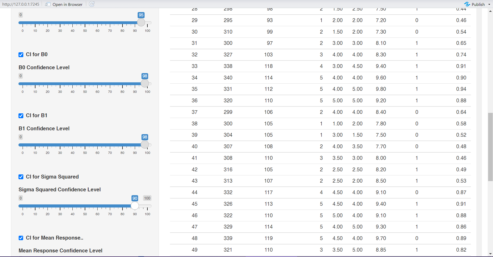
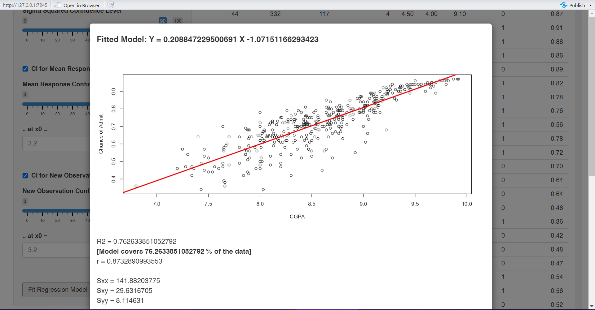
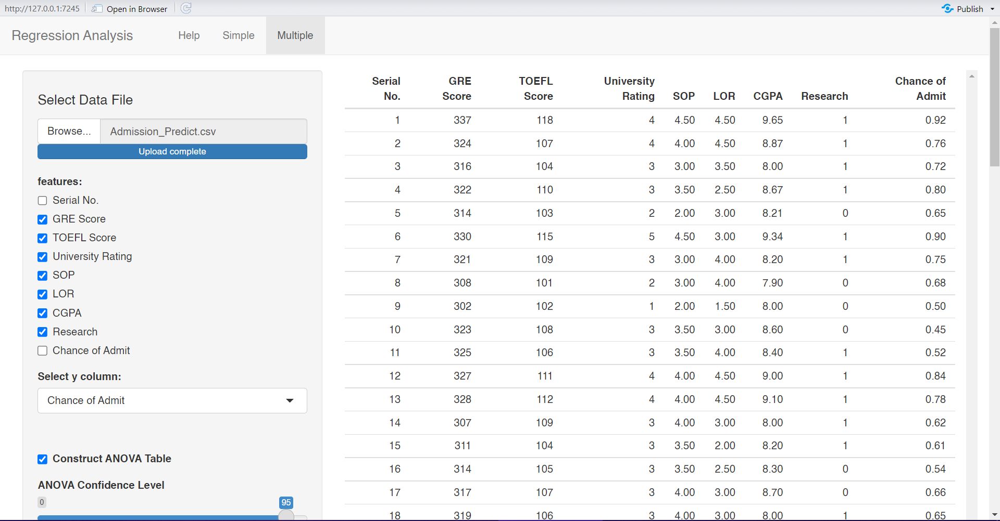
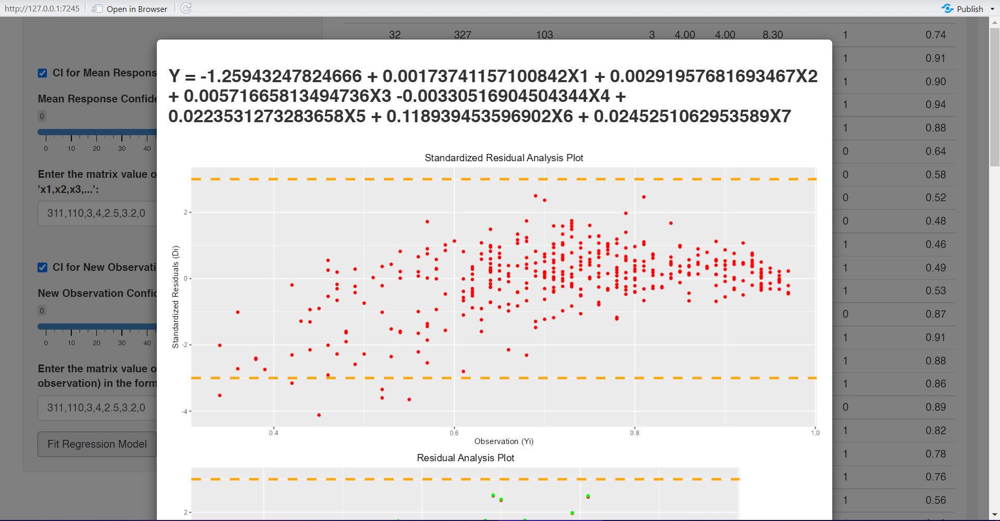
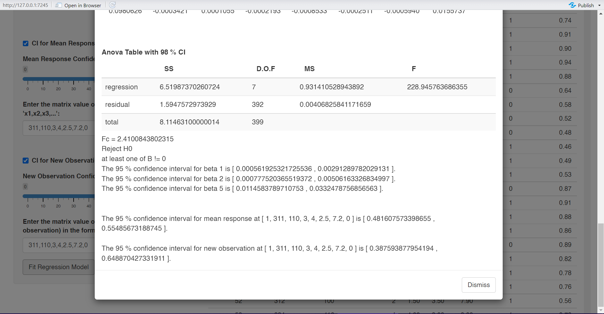

# regression-analysis-application

App deployed to [shinyapps.io](https://7qa8yk-verina-michel.shinyapps.io/reg_run/)

This was our final project for the Regression Analysis course taught by Prof. Amr Amin. 
The project requested initially was to implement simple and multiple regression from scratch using R. We decided to bundle our implementation into a package, and create a simple UI that uses this implementation for performing Linear Regression Analysis.  

Here are the two packages we implemented:
- [linreg](https://github.com/verinak/linreg) : for Simple Linear Regression
- [cvreg](https://github.com/verinak/cvreg) : for Multiple Linear Regression

## Application Overview

The application starts with a written introduction to linear regression.  

  

From the tabs at the top left, the user can pick to perform either simple or multiple regression analysis. 
The user can then upload data (allowed file formats: csv, txt, json, xls/xlsx, psv, tsv, rds, fwf, sas7bdat, sav, dta) into the application, and specify the X and Y variables. They can customize the type of calculations they would like to perform (ANOVA, Confidence Intervals). Then, they can fit the model, view the output, and return to change any of their previous choices then recalculate again.
  

The Simple tab (uses linreg package):   

  

The Multiple tab (uses cvreg package):   

  

## Contributors
[Ola Mamdouh](https://github.com/olamahdi) 
[Verina Michel](https://github.com/verinak) 
[Marly Magdy](https://github.com/marlymagdy) 
[Maria Anwar](https://github.com/Maria1516) 
[Mirna Tarek](https://github.com/Mirna-tarek) 
[Mariem Nasr](https://github.com/MariemNasr) 
